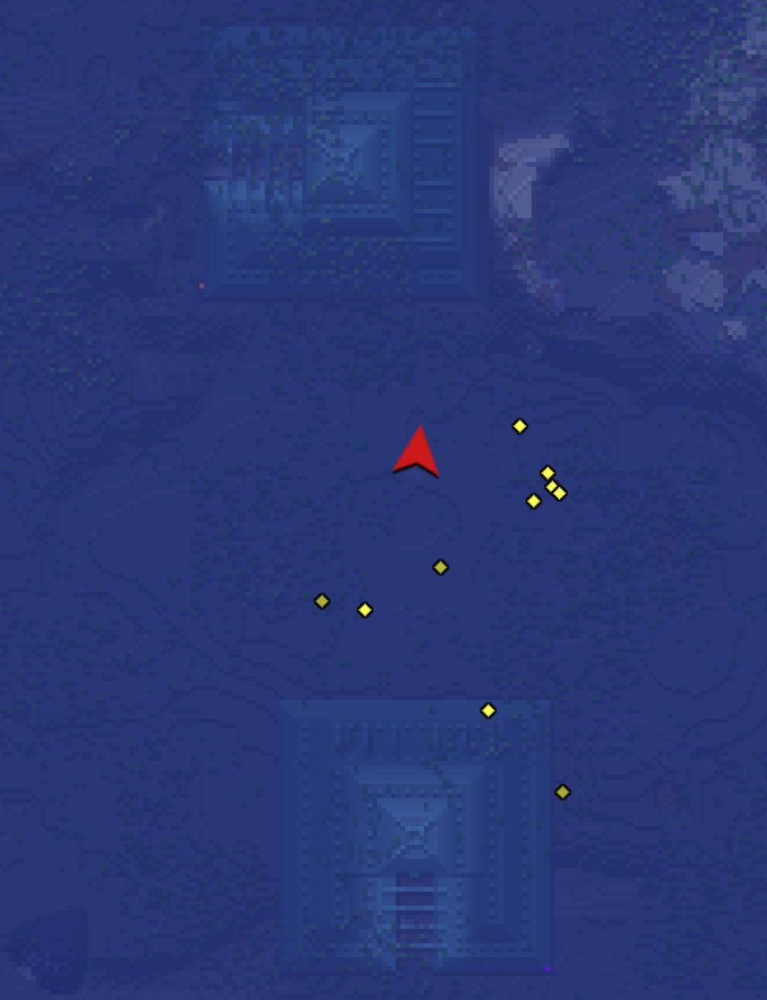
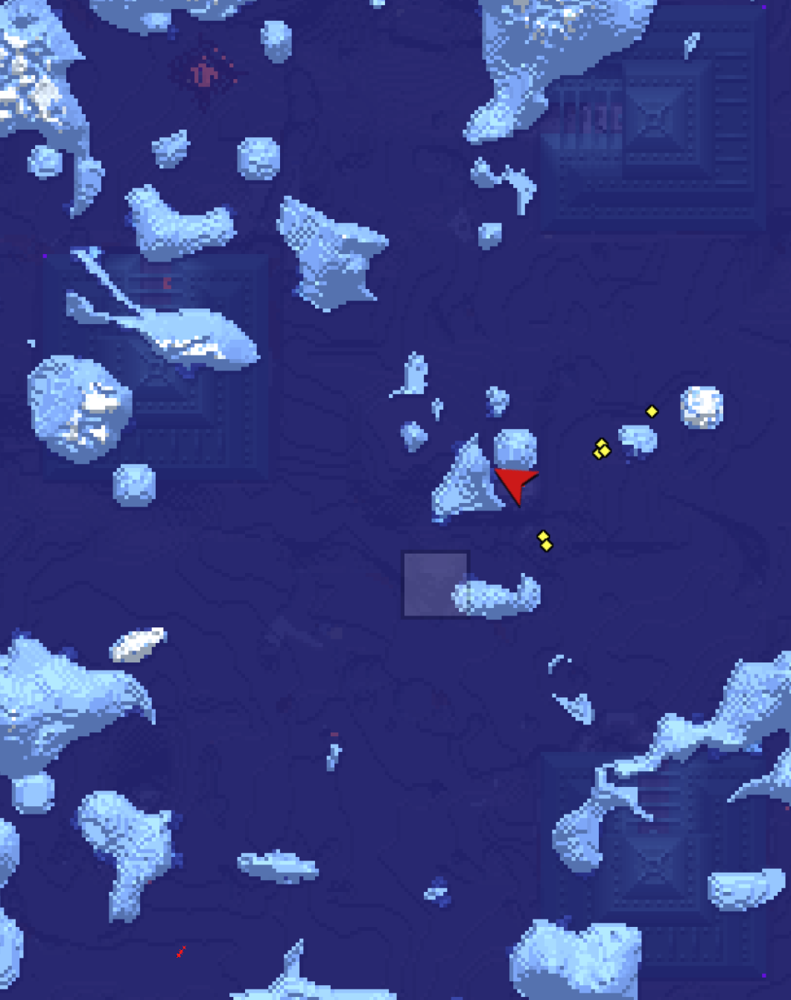
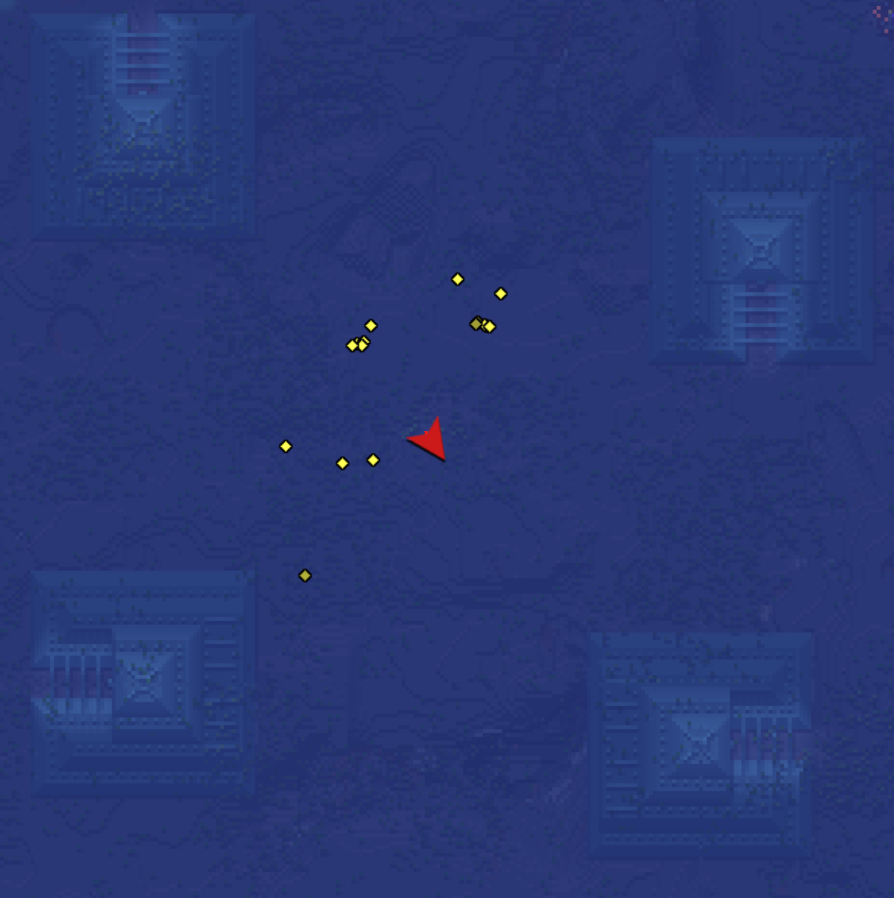

# DoubleTripleQuadMonumentFinder

DoubleTripleQuadMonumentFinder is a **high-performance Minecraft Java Edition Double/Triple/Quad Ocean Monument finder** designed for **very large search ranges.** This tool is optimized for **speed, parallelism, and correctness.**

**Small Quirk: I will be using the terms _Ocean Monument_ and _Monument_ interchangeably.**

---

## Why This Tool?

Typically, players build an endgame portal-based Guardian farm, which is super fast. They usually require having an AFK point. But sometimes there are other neighboring monuments within 128 block radius, so players can take advantage of building 2, 3, or 4 same farms to increase ~2x, ~3x, or ~4x the rates respectively (the reason why roughly is because an AFK point does not cover all of the full monuments). This tool answers a more practical question:

> Given my seed and specific search ranges, does my world have double, triple, or quad monuments? If so, what are the AFK points?

As a reference, **[cubiomes-viewer](https://github.com/Cubitect/cubiomes-viewer)** includes an option to search for AFK spots that contain **quad monuments.** This project focuses on the same idea, but also supports searching for **double** and **triple** monument AFK spots, which can be useful when a seed does not absolutely have quad monuments in the entire world.

**Unfortunately, this tool does not include calculating seeds that have double/triple/quad monuments with a specified range, similar to Cubiomes.**

---

## Performance Notes

Tested on:

-   **Apple M3 Max**
-   **36 GB unified memory**
-   Java 17
-   macOS

On this machine:

- Took at most 7 minutes to search for AFK points with triple monuments in the entire world bounded by the world border (so 59,999,968 x 59,999,968)
- Took at most 4 minutes to search for AFK points with quad monuments in the entire world bounded by the world border (so 59,999,968 x 59,999,968)
	- I should also point out that Cubiomes quickly identifies quad monuments in less than a second, even at that range.

---

## Empirical Analysis

- A region is a 512 x 512 block area. Each region contains at most one ocean monument.

**Given a 1M x 1M area and using 128 block radius in a center of each monument:**

- There is **between ~303,532 and ~384,639 ocean monuments total.**

  - This means the probability of having an ocean monument in a region is **between ~7.957% and ~10.083.%**

- However, **between ~294,068 and ~378,318** of them are isolated, which means the tool prunes **between ~96.882% and ~98.330%** of ocean monuments. 
	- To further clarify, this statistic means that given an ocean monument $\ O_1=(x_1, z_1)$ (ignoring y value), if the distance between that and the closest one, $\ O_c=(x_c, z_c)$, is more than 256 blocks, then it cannot be used for identifying double, triple, and quad monuments. This is because monsters never spawn outside of 128 block radius (spherical), so $\ O_1$ is eliminated from the monuments list.
  - Intuitively, an ocean monument region whose neighboring regions (North, Northwest, West, Southwest, South, Southeast, East, and Northeast) contain 0 monuments is eliminated.
  - This means the probability that $\ O_1$ pairs with $\ O_c$ within 256 blocks is **between ~1.671% and ~3.218%.**
- This leaves **between ~6,321 and ~9,464** monuments capable of creating double monuments.
- **LIMITATION:** the reduction between double to triple monuments and triple to quad monuments is not observed.

### Coverage Factor

**Not all AFK spots are created equal.** While analyzing, I implemented _coverage_ values, indicated by `totalCovered` value. As I narrowed down, I noticed that AFK spots that covers specific monument types (double, triple, quad) have different coverage values. Here is what I observed that led me to simplify computation:

- Using the [Minihud](https://modrinth.com/mod/minihud) mod, the bounding box of the ocean monument are guardian spawns. It measures 58x58 square, with y level 39 to 61 inclusive, meaning that **the size of a bounding box is 58x23x28 blocks.**
	- This equates **77,372 guardian spawn blocks in a fully covered monument.**
	- In a double monument, 154,744 blocks is the maximum coverage value.
	- In a triple monument, 232,116 blocks is the maximum coverage value.
	- In a quad monument, 309,488 blocks is the maximum coverage value.
- Given $\ k$ monuments $\ O_1, ..., O_k$ and visualizing in 2D, we grab their center coordinates $\ (c_{x1}, c_{z2}), ..., (c_{xk}, c_{zk})$. We graph $\ k$ circles, all with radius 128 with centers $\ (c_{x1}, c_{z2}), ..., (c_{xk}, c_{zk})$. Then the feasible AFK region, $\ F$, is the most overlap of $\ k$ circles, which is defined as $\ F = \bigcap_{i=1..k}{\{(x,z) | (x-c_{xi})^2+(z-c_{zi})^2\leq 128^2\}}$. 
	- Within $\ F$, we pick the points that maximizes the coverage value.

The second statement is pivotal. I realized in the worse case scenario, if you have an AFK point that has two monuments but their centers are closer to 128 blocks away from the AFK point, then you end up having at most 50% coverage. Because of this, I realized **it is more efficient to eliminate isolated monuments singles/pairs/triples if the closest monument $\ O_c$ is more than 224 blocks away instead of 256 blocks away.**

This ultimately reduces the chances of having a heap problem when searching the entire world to find AFK points with triple or quad monuments (but absolutely not necessary for double monuments, since they are easier to find).

---

## Type Guarantees

In a 59,999,968 x 59,999,968 world (taking account with world borders in vanilla survival):
- You are guaranteed to get at least one AFK point with double monuments if you search a square radius of **25,000 blocks** (meaning searching a 50,000 x 50,000 square with endpoints (-25,000, -25,000), (-25,000, 25,000), (25,000, -25,000), and (25,000, 25,000)). 
	- However, the closest one is not necessarily the maximum _coverage_.
	- If you search a square radius of **50,000 blocks** (meaning searching a 100,000 x 100,000 square with endpoints (-50,000, -50,000), (-50,000, 50,000), (50,000, -50,000), and (50,000, 50,000)) instead, then you are guaranteed to get at least one AFK point with **100% coverage.**
- You are guaranteed to get at least one AFK point with triple monuments if you search a square radius of **12,500,000 blocks** (meaning searching a 25,000,000 x 25,000,000 square with endpoints (-12,500,000, -12,500,000), (-12,500,000, 12,500,000), (12,500,000, -12,500,000), and (12,500,000, 12,500,000)). 
	- Keep in mind that most of the times they will be more than 100,000 blocks away from the origin, even in the Nether. So I recommend building player cannons that can quickly travel at long distances.
	- **Unfortunately, it is impossible to have an AFK point with 100% coverage in a triple monument.** You will end up getting the highest coverage number though.
- Getting a quad monument in a random seed throughout the entire world is almost always impossible.
	- It is also impossible to have an AFK point with 100% coverage in a quad monument.


---

## How DoubleTripleQuadMonumentFinder Works

This tool works in three major stages:

### **1) Fast Monument Placement (Math Only)**

Minecraft places ocean monuments using a region-based system (512×512 blocks per region).
For each region in the requested search range, the tool deterministically computes the **candidate monument start chunk** using the world seed and monument spacing rules (1.18+ logic).
This phase is pure math and runs in parallel. No world generation via creating server is needed.

### **2) Aggressive Pruning + Biome Validation**

Most monuments are isolated and cannot form double/triple/quad setups.
Using a geometric guarantee, along with tighter distances to focus on higher coverage values:  

> If an AFK point is within 112 blocks of two monuments, those monuments must be within 224 blocks of each other.

The tool safely eliminates monuments that cannot possibly pair. This reduces memory usage by over **95%+** in large searches.
Remaining candidates are then validated using **cubiomes** via a JNI bridge to ensure biome correctness and eliminate false positives.

### **3) AFK Spot Search + Coverage Optimization**

For double, triple, or quad searches:
-   Each monument center is treated as a **128-block radius circle**.
-   The AFK region is the intersection of those circles.
-   Valid AFK positions are evaluated for **guardian spawn coverage** using monument bounding boxes.

Overall, this combination of **parallel placement math**, **aggressive geometric pruning**, and **cubiomes validation** allows extremely large search ranges (even world-border scale) to complete in minutes.

---

## Minecraft Version Compatibility (1.18+)

This tool works on version 1.18+.

---

## Requirements

To reduce any potential errors such as `command not found`, download the required tools.

- [Java **17+**](https://www.oracle.com/java/technologies/downloads/) (required)

**If you download a Release ZIP (recommended):**

- No additional tools needed

**If you build from source (developers):**

- **[Git](https://git-scm.com/install/windows)** (required for cloning the repository and submodules)

- **[Clang](https://winlibs.com)** (required to compile `libcubiomeswrap.dylib`)
	- I recommend watching this [video](https://youtu.be/4Ob_w1yDd6M?si=6N6c6BzGkQ6dycOm) on installing Clang. You will need to configure the `PATH` variable to execute Clang.

---

## Build (Development Version)

Currently, you must compile the native cubiomes wrapper manually. This step is highly recommended because without it, you will get results that do not have ocean monuments (very inaccurate).

### Compile `libcubiomeswrap.dylib` (macOS)

This project uses a small JNI shim (`native/cubiomeswrap_jni.c`) compiled together with the **cubiomes** source files.

1) Ensure you have a Java 17+ JDK installed and set `JAVA_HOME`:

```bash
export JAVA_HOME=$(/usr/libexec/java_home)
```  

2) Clone cubiomes into `external/`:

```bash
mkdir -p external
cd external
git clone https://github.com/Cubitect/cubiomes.git
cd ..
```

3) Point `CUBIOMES_DIR` to the cubiomes source folder (the one containing `generator.c`, `biomes.c`, etc.):

```bash
export CUBIOMES_DIR="$PWD/external/cubiomes"
```

4) Compile the JNI wrapper + cubiomes sources into a macOS dynamic library:

```bash
clang -dynamiclib -O2 -fPIC \
-I"$JAVA_HOME/include" \
-I"$JAVA_HOME/include/darwin" \
-I"$CUBIOMES_DIR" \
-o libcubiomeswrap.dylib \
native/cubiomeswrap_jni.c \
"$CUBIOMES_DIR"/biomenoise.c \
"$CUBIOMES_DIR"/biomes.c \
"$CUBIOMES_DIR"/finders.c \
"$CUBIOMES_DIR"/generator.c \
"$CUBIOMES_DIR"/layers.c \
"$CUBIOMES_DIR"/noise.c \
"$CUBIOMES_DIR"/util.c \
-lm
```

5) Verify the JNI symbols are present (you should see `Java_OceanMonumentCoords_...`):

```bash
nm -gU libcubiomeswrap.dylib | grep -i Java_
```

If you see something like this:

```bash
0000000000000500 T _Java_OceanMonumentCoords_00024CubiomesSupport_00024CubiomesHandle_c_1create
00000000000007c0 T _Java_OceanMonumentCoords_00024CubiomesSupport_00024CubiomesHandle_c_1free
0000000000000584 T _Java_OceanMonumentCoords_00024CubiomesSupport_00024CubiomesHandle_c_1isViableMonument
00000000000005c4 T _Java_OceanMonumentCoords_00024CubiomesSupport_00024CubiomesHandle_c_1isViableMonumentBatch
```

This means the library did export the JNI entrypoints. Otherwise, Java will fail with `UnsatisfiedLinkError`.

Verify that `libcubiomeswrap.dylib` exists by checking the folder. If it is present, then you created Cubiomes oracle.

---

## Running DoubleTripleQuadMonumentFinder

First, compile Java to create classes:
```bash
javac Main.java OceanMonumentCoords.java AFKSpotFinder.java MaximumCoverageAFK.java
```
Then once it is successful, run Main:

```bash
java Main <seed> <type> <rangeBlocks> <excludeRadius> <threads>
```

### Arguments

All 5 arguments are required. 

| Argument  | Description |
| -- | -- |
|`seed`|The Minecraft world seed to analyze (must be a number).|
|`type`|The type of monuments you want to search (options: `double`, `triple`, `quad`, case-insensitive)|
|`rangeBlocks`|Search radius in blocks (as a square) around the world origin (0,0).|
| `excludeRadius` |Inner square radius (in blocks) to exclude from the search. Enables ring-based scans for large worlds. Setting it to 0 runs a full square|
| `threads` | Number of threads in your search. _This depends on your CPU and the number of cores, so be mindful. Try 4 or 8 threads._ |

Example:

```bash
java Main 2595230174950416391 triple 29999984 0 8
```

This command:
- sets seed to 2595230174950416391.
- searches for AFK points that have triple monuments
- searches through 29999984 blocks square radius (which is the entire world bounded by the world borders)
- sets the `excludeRadius` to 0, meaning we run the full square
- uses 8 threads


---

## Output

The analysis results are written to:

```bash
results.csv
```

Each line contains:

```bash
type,afkX,afkY,afkZ,netherX,netherY,netherZ,placeBlockX,placeBlockY,placeBlockZ,totalCovered,count,monuments
```

To explain what it is:
- `type` refers to whether you are searching for double, triple, or quad.
- `afkX`, `afkY`, and `afkZ` are the coordinates for a player to stand on as an overworld AFK point.
- `netherX`, `netherY`, and `netherZ` are the coordinates of a Nether's counterpart of an overworld AFK point.
- `placeBlockX`, `placeBlockY`, and `placeBlockZ` are the coordinates for a player requiring to place a block at this spot to build an AFK point.
- `totalCovered` refers to the number of guardian-spawn blocks covered within 128 blocks _spherical_ (not cylindrical) radius of an AFK point. The higher, the better.
- `count` refers to the number of monuments covered from an AFK point, which is intuitively 2 if double, 3 if triple, or 4 if quad.
- `monuments` refers to the list of monuments' coordinates (keep in mind that these coordinates are the _centers_).

For example:

```bash
triple,11946919,50,-565282,1493365,50,-70660,11946919,49,-565282,218621,3,"(11946864,-565200);(11946880,-565376);(11947008,-565232)"
```

This means we are searching for AFK points with triple monuments. The AFK spot in the overworld is x = 11,946,919, y = 50, and z = -565,282. The Nether's counterpart of the AFK spot is x = 1,493,365, y = 50, and z = -70,660. You place a block at x = 11,946,919, y = 49, and z = -565,282. This AFK point covers 218,621 squares, meaning it has ~94.19% coverage. There are three monuments with coordinates (11,946,864, -565,200), (11,946,880, -565,376), and (11,947,008, -565,232). 

**Results are sorted by descending coverage values, then by ascending distance from the origin.**

**Tip:** I highly recommend saving the `results.csv` into a different folder (preferably outside of the root folder) or renaming it because if you rerun, it will overwrite it.

---

## Calculating Portal Coordinates

**Warning: make sure you test this before building the farms.** If you are building portal-based guardian farms, each of which covers the entire bounding box, then here are the steps:

1. Choose the first entry that has the maximum coverage (and if there is a tie, then it selects the closest to the origin).
2. The nether coordinate that converges overworld ocean monuments' portals to it is the `netherX` and `netherZ` value for x and z coordinates respectively. You can ignore the y value, depending on your context. 

The smaller `totalCovered` it is as you look down, the harder or impossible linking three monuments to one nether portal it becomes.

### Example

After I ran `java Main -141 double 50000 0 8`, the output is (only listing the first 5 printed lines):

```bash
type,afkX,afkY,afkZ,netherX,netherY,netherZ,placeBlockX,placeBlockY,placeBlockZ,totalCovered,count,monuments
double,-12032,50,7616,-1504,50,952,-12032,49,7616,154744,2,"(-12048,7552);(-12032,7696)"
double,-22240,50,-6704,-2780,50,-838,-22240,49,-6704,154744,2,"(-22224,-6640);(-22256,-6768)"
double,-49696,50,-25824,-6212,50,-3228,-49696,49,-25824,154744,2,"(-49776,-25808);(-49616,-25840)"
double,29638,50,-17372,3705,50,-2171,29638,49,-17372,154722,2,"(29728,-17392);(29552,-17344)"
...
```

I choose the first entry, which is `double,-12032,50,7616,-1504,50,952,-12032,49,7616,154744,2,"(-12048,7552);(-12032,7696)"`. This means the Nether coordinate is x = -1,504, y = 50, and z = 952. 

---

## Sample Screenshots:

### Double Monuments

From seed -141 with AFK spot at x = -12,032, y = 50, and z = 7,616 and 154,744 guardian-spawn blocks covered (100% coverage):




### Triple Monuments

From seed 694 with AFK spot at x = -1,608,210, y = 50, and z = -9,283,682 and 219,647 guardian-spawn blocks covered (~94.63% coverage):




### Quad Monuments

_Full Disclosure: I had to use cubiomes to find seeds that have quad monuments. As mentioned earlier, it is almost impossible to have a quad monument with a random seed._
From seed 4803524437 with AFK spot at x = -31,815, y = 50, and z = -19,009 and 282,308 guardian-spawn blocks covered (~91.22% coverage):




---

## FAQs and Troubleshooting:

1. **Does this work on Bedrock Edition:** Unfortunately, no. The code that identifies ocean monuments is completely different from Java.
2. **Can this locate sponge rooms:** No. However, you can look at [here](https://github.com/BrianBLee1201/SpongeAnalyzer), which I created a tool for you.
3. **Why did you pick at y level 50 when calculating the AFK point:** because it yields the highest coverage. 
I had been experimenting different y values, and the results show that y level 50 is the ideal layer. Since monuments range from y levels 39 to 61 inclusive and spheres are perfectly symmetrical, I simply took the average of two numbers, which is $\ (39+61)/2=50$. 
4. **Why did you write y level 50 in the Nether:** it depends on context. It is optional if you intend to collect the items in the Nether. I noticed that it is easier to travel in the Nether above the Nether roof than below it, and in the former case, players find it easier building to avoid hostile Nether mobs attacking them. 
However, if you intend to collect items in the overworld side (Guardians teleporting from Overworld to Nether ➡️ Guardian dies in the Nether via fall damage/player killing ➡️ drops get sent back to the Overworld), then the y level does matter. You do not want Guardians to accidentally teleport to the wrong spot in the Nether, and you do not want to teleport the drops to the wrong side in the Overworld, where it will lag the game if you do not collect it.
As always, **test this in creative.**
5. **You mentioned portal-based guardian farms. Which one do you recommend:** [this one] (https://discord.com/channels/1161803566265143306/1444281607254183988/1444281607254183988). You might want to create a Discord account and join the TMC Catalogue server to get the schematics and world download. 
6. **I noticed I am getting a heap error:** there are two cases:
	- If you are searching for double monuments, **only search at a range of 50,000 blocks radius,** as you are guaranteed to have one AFK point that has a maximum coverage.
		- If that did not work, try to partition your search in a small square, then in concentric rings (for example, a square with radius 20,000 blocks ➡️ square radius of 40,000 blocks and excluding square radius of 20,000 blocks ➡️ square radius of 50,000 blocks and excluding square radius of 40,000 blocks). Take notes on `results.csv`, as successful searches overwrite it. 
    - If you are searching for triple or quad monuments, try to partition your search into a square, then in concentric rings.
7. **Why not use Chunkbase:** for checking if ocean monuments exist, you can do that. However, they do not have a feature to draw a circle.